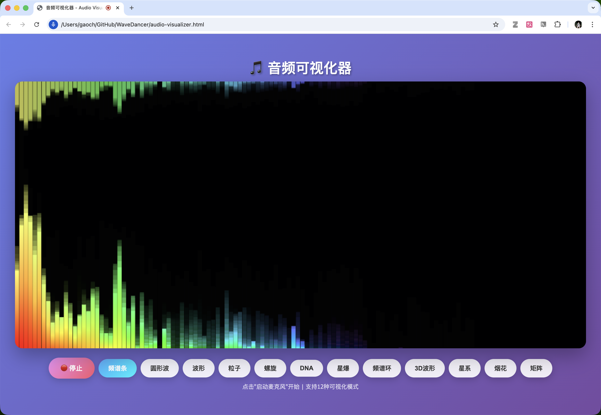
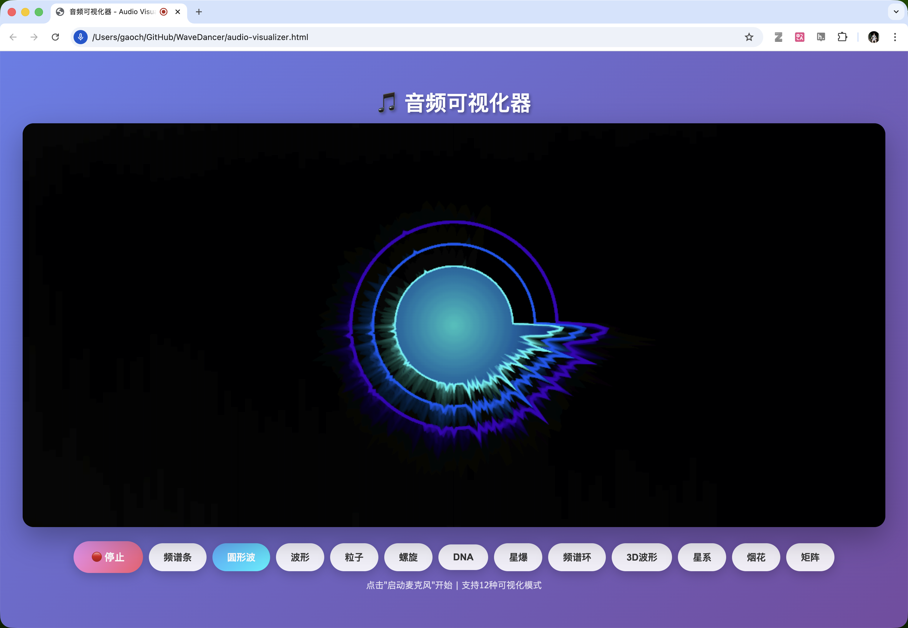
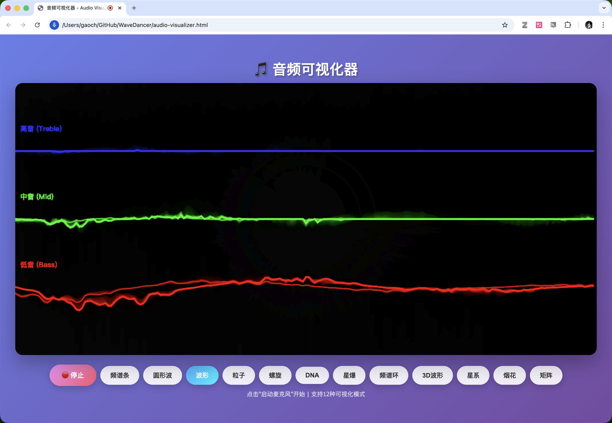
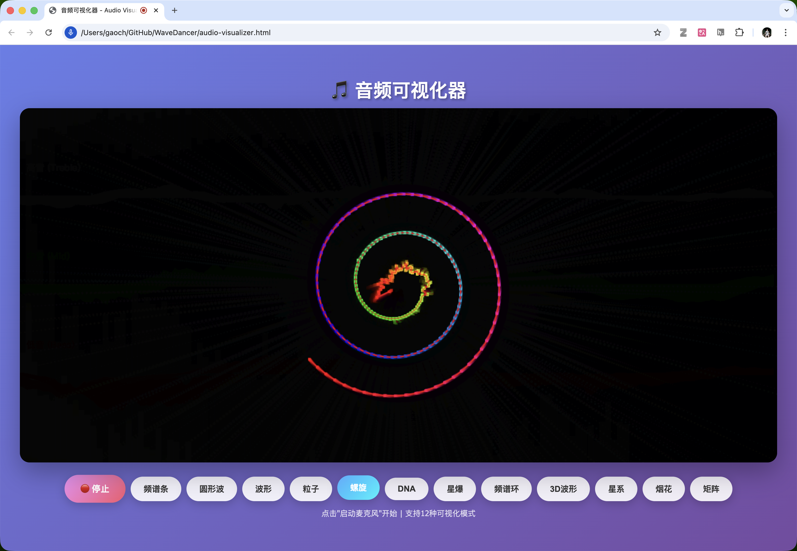
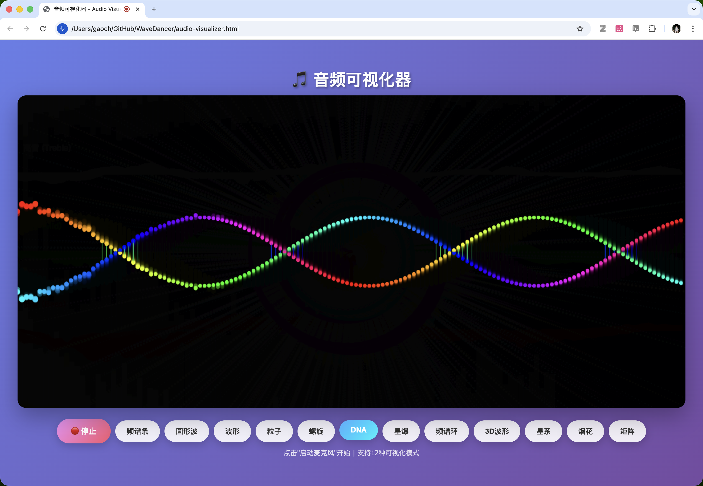
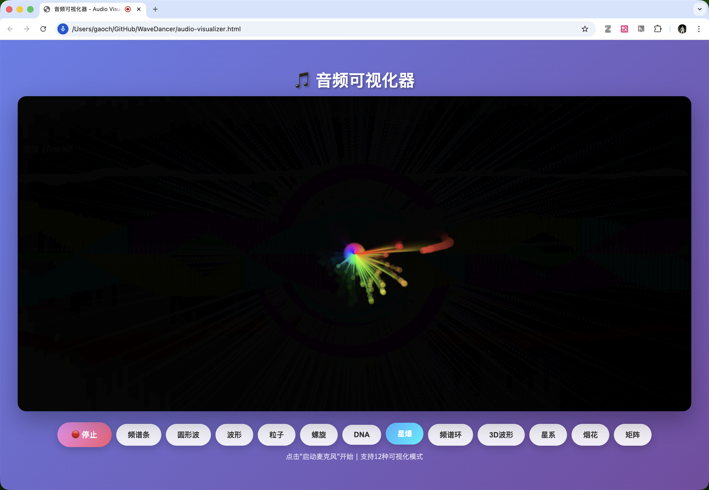
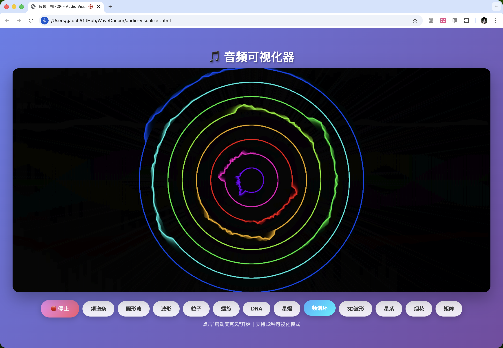
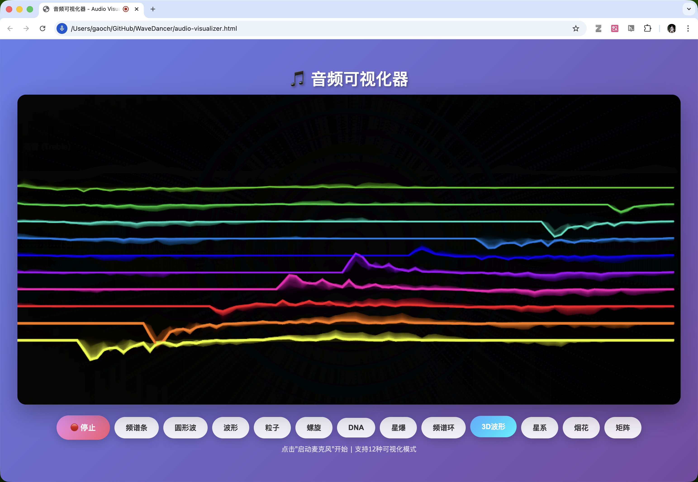
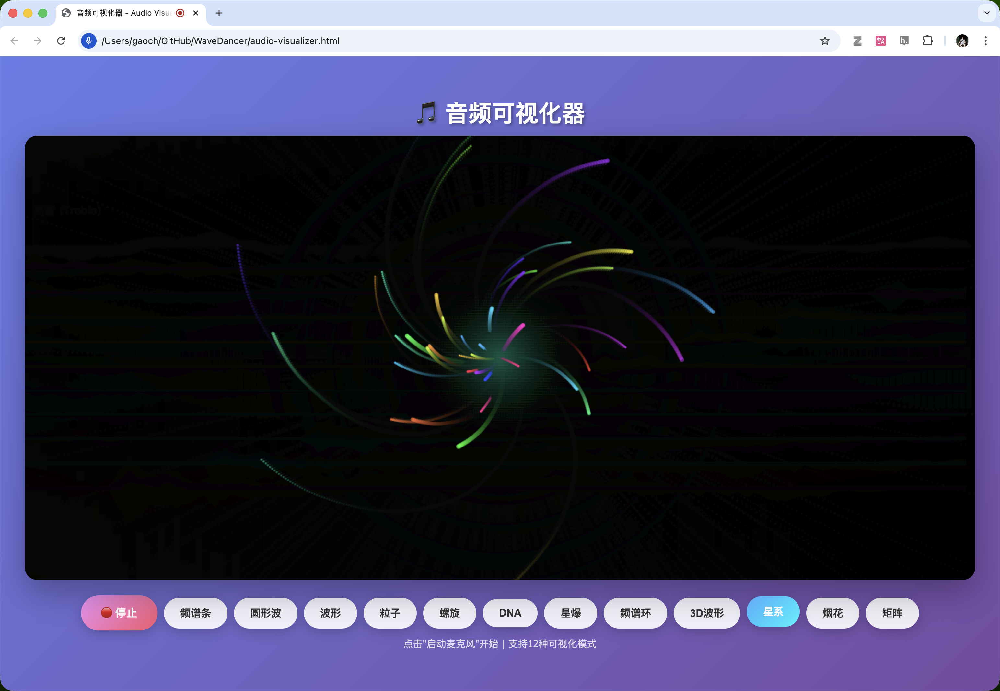
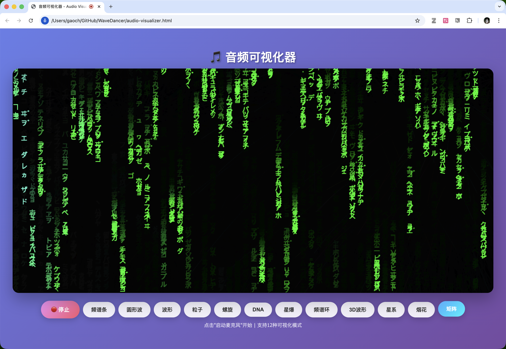

# 🎵 WaveDancer

> 让你的声音跳起舞来！一个超酷的实时音频可视化工具 🎨✨

[](https://github.com/gaospecial/WaveDancer)
[](LICENSE)
[](https://github.com/gaospecial/WaveDancer)

## 🎭 这是什么？

WaveDancer 是一个基于 Web Audio API 的实时音频可视化工具。它能把你的声音（或者任何音频输入）转换成超炫的视觉效果。无论你是在唱歌、说话、还是播放音乐，WaveDancer 都能让你的声音"看得见"！

**一句话总结**：把声波变成艺术品的魔法棒 🪄

## ✨ 特性

- 🎤 **实时麦克风输入**：打开麦克风，立即看到声音的舞蹈
- 🎨 **12种可视化模式**：从经典频谱到炫酷粒子效果，总有一款适合你
- 🚀 **零依赖**：纯原生 JavaScript，打开就能用
- 📱 **响应式设计**：在手机、平板、电脑上都能完美运行
- 🎯 **高性能**：使用 Canvas 和 Web Audio API，流畅如丝
- 🌈 **渐变色彩**：动态色彩系统，让每一帧都是艺术

## 🎪 12种可视化模式展示

### 1️⃣ 频谱条 (Bars)
经典的频谱柱状图，看着就很专业！


### 2️⃣ 圆形波 (Circle)
声波围成一个圈，像是在跳圆舞曲 💃


### 3️⃣ 波形 (Wave)
高中低音分层显示，让你看清声音的"三围"


### 4️⃣ 粒子 (Particles)
声音越大，粒子越疯狂！


### 5️⃣ 螺旋 (Spiral)
声波沿着螺旋线舞动，优雅又迷幻


### 6️⃣ DNA双螺旋 (DNA)
你的声音也有基因密码？


### 7️⃣ 星爆 (Starburst)
从中心向外爆发的能量射线 ⚡


### 8️⃣ 频谱环 (Rings)
一圈又一圈，像水面的涟漪


### 9️⃣ 3D波形 (Waveform 3D)
给波形加上景深效果，立体感满满


### 🔟 星系 (Galaxy)
你的声音创造了一个小宇宙 🌌


### 1️⃣1️⃣ 烟花 (Fireworks)
声音越响，烟花越绚烂 🎆


### 1️⃣2️⃣ 矩阵 (Matrix)
进入黑客帝国，看声音的代码流


## 🚀 快速开始

### 方法一：直接使用（推荐）

1. 克隆仓库：
```bash
git clone https://github.com/gaospecial/WaveDancer.git
cd WaveDancer
```

2. 用浏览器打开 `audio-visualizer.html`

3. 点击"启动麦克风"按钮

4. 开始你的声音表演！🎤

### 方法二：在线体验

访问 GitHub Pages（如果已部署）：
```
https://gaospecial.github.io/WaveDancer/
```

## 🎮 使用指南

1. **启动麦克风**：点击"🎤 启动麦克风"按钮，允许浏览器访问你的麦克风
2. **切换模式**：点击任意可视化模式按钮，实时切换效果
3. **发出声音**：唱歌、说话、播放音乐，看着你的声音跳舞
4. **停止**：再次点击按钮停止可视化

### 💡 小贴士

- 🎵 **音乐效果最佳**：播放音乐时效果最震撼
- 🔊 **调整音量**：声音太小可能看不到效果，太大可能"爆表"
- 🎨 **多试几种模式**：每种模式都有独特的美感
- 📱 **手机也能玩**：在手机上打开也很流畅

## 🛠️ 技术栈

- **Web Audio API**：音频处理和分析
- **Canvas API**：高性能图形渲染
- **FFT 分析**：快速傅里叶变换，将音频转换为频谱数据
- **原生 JavaScript**：无框架，纯粹的 JS 魔法

### 核心技术亮点

- ✅ 使用 `AnalyserNode` 进行实时音频分析
- ✅ FFT 大小设置为 4096，提供精细的频率分辨率
- ✅ 平滑时间常数 0.8，让动画更流畅
- ✅ `requestAnimationFrame` 实现 60fps 渲染
- ✅ 响应式 Canvas 尺寸，适配各种屏幕

## 📊 性能优化

- 🚄 **高效渲染**：使用 Canvas 2D 上下文，性能优异
- 🎯 **智能采样**：根据不同模式调整采样点数量
- 💾 **内存管理**：粒子系统自动清理过期对象
- 🔄 **平滑动画**：使用 smoothingTimeConstant 避免抖动

## 🎨 自定义开发

想要添加自己的可视化模式？很简单！

```javascript
// 在 draw() 函数的 switch 语句中添加新模式
case 'mymode':
    drawMyMode();
    break;

// 实现你的绘制函数
function drawMyMode() {
    // 清除画布
    ctx.fillStyle = 'rgba(0, 0, 0, 0.1)';
    ctx.fillRect(0, 0, canvas.width, canvas.height);
    
    // 获取音频数据
    analyser.getByteFrequencyData(dataArray);
    
    // 你的创意代码...
    // dataArray 包含了频谱数据
    // bufferLength 是数据数组的长度
}
```

## 🤝 贡献

欢迎提交 Issue 和 Pull Request！

如果你有好的想法或者发现了 bug，请：

1. Fork 这个仓库
2. 创建你的特性分支 (`git checkout -b feature/AmazingFeature`)
3. 提交你的改动 (`git commit -m 'Add some AmazingFeature'`)
4. 推送到分支 (`git push origin feature/AmazingFeature`)
5. 开启一个 Pull Request

## 📝 待办事项

- [ ] 添加音频文件上传功能
- [ ] 支持录制可视化视频
- [ ] 添加更多可视化模式
- [ ] 支持自定义颜色主题
- [ ] 添加全屏模式
- [ ] 支持导出为 GIF 动图

## 🐛 已知问题

- 某些浏览器可能需要 HTTPS 才能访问麦克风
- 在 iOS Safari 上可能需要用户交互才能启动音频

## 📄 许可证

MIT License - 随便用，记得给个 Star ⭐

## 🙏 致谢

- 感谢 Web Audio API 让音频处理变得如此简单
- 感谢所有为开源社区做出贡献的开发者
- 感谢你的使用和支持！

## 📮 联系方式

- GitHub: [@gaospecial](https://github.com/gaospecial)
- 项目地址: [WaveDancer](https://github.com/gaospecial/WaveDancer)

---

<div align="center">

**如果这个项目对你有帮助，请给个 Star ⭐**

**让更多人看到声音的舞蹈！**

Made with ❤️ and 🎵

</div>
